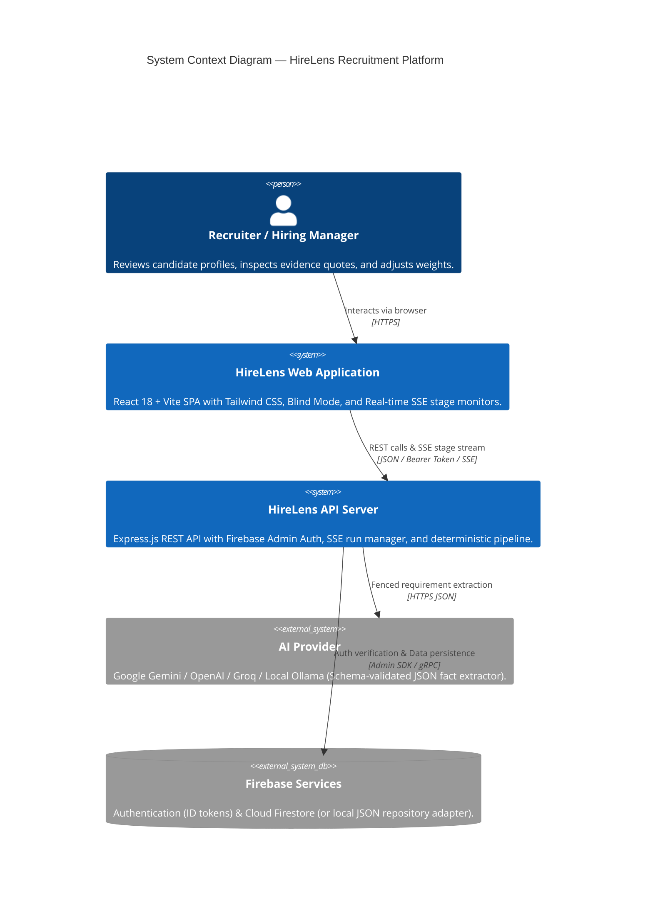
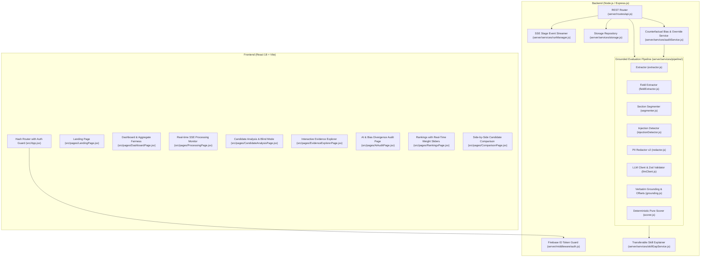
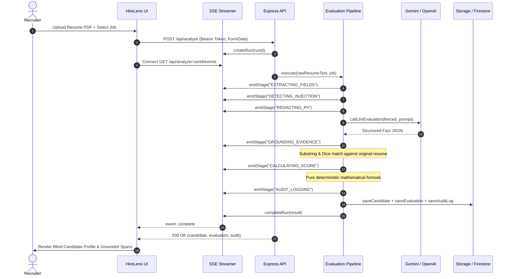

# HireLens — System Architecture & Truth Table

## 1. System Overview

HireLens is an evidence-backed recruitment intelligence platform designed to eliminate hallucinations, enforce transparent deterministic scoring, and mitigate demographic bias in candidate evaluations.

---

## 2. Container & Component Architecture

---

## 3. Resume -> Structured Insight Data-Flow

---

## 4. Architecture Truth Table (Implementation Verifiability)

Every component claim is verified against the codebase as of this version:

| Component / Subsystem | Status | File Path | Verification Proof |
| :--- | :---: | :--- | :--- |
| **Field Extraction (No Fake Defaults)** | `IMPLEMENTED` | `server/services/fieldExtractor.js` | Returns `NOT_FOUND` on missing fields; computes confidence; extracts real emails/phones/skills. |
| **Section Segmentation** | `IMPLEMENTED` | `server/services/segmenter.js` | Standalone header matching; excludes inline degree/tools. |
| **PDF & DOC Text Extraction** | `IMPLEMENTED` | `server/services/extractor.js` | Rejects scanned/empty PDFs with `SCANNED_OR_EMPTY_PDF`; rejects binary `.doc` with `UNSUPPORTED_LEGACY_DOC`. |
| **PII Redaction v2 (Date-safe)** | `IMPLEMENTED` | `server/services/pipeline/redactor.js` | Preserves `2020 - 2022` date ranges untouched; redacts names, emails, phones, pronouns. |
| **Prompt Injection Defense** | `IMPLEMENTED` | `server/services/pipeline/injectionDetector.js` | Flags adversarial directives (`injectionSuspected: true`); fences untrusted resume text inside `<resume_text>`. |
| **Versioned Prompts** | `IMPLEMENTED` | `server/prompts/evaluation.v1.txt` | Explicit system prompt with `PROMPT_VERSION = 'v1.0.0'`. |
| **Multi-Provider LLM Client** | `IMPLEMENTED` | `server/services/pipeline/llmClient.js` | Supports Native Gemini, OpenAI, Groq, Ollama; 30s timeout, retries, and Zod schema validation. |
| **Transparent Heuristic Fallback** | `IMPLEMENTED` | `server/services/pipeline/evaluationEngine.js` | Runs when no API key is set; labelled `analysisMode: 'heuristic'` in UI; zero fake evidence strings. |
| **Verbatim Grounding & Offsets** | `IMPLEMENTED` | `server/services/pipeline/grounding.js` | Strict whole-quote substring matching; rejects hallucinations to `UNVERIFIED`; records charStart/charEnd. |
| **Deterministic Pure Scorer** | `IMPLEMENTED` | `server/services/pipeline/scorer.js` | Pure function based on weighted grounded skills, pro-rated experience, and quantified impact metrics. Score 0 handled. |
| **Job Entity & Multi-JD Isolation** | `IMPLEMENTED` | `server/services/pipeline/jobService.js` | Evaluations belong to `(candidateId, jobId)` pair; parsing JD into structured weighted requirements. |
| **Candidate Profile Consolidation** | `IMPLEMENTED` | `server/services/profileConsolidator.js` | Re-evaluating candidate against new job appends evaluation without overwriting old job score. |
| **Blind Review Mode** | `IMPLEMENTED` | `src/pages/CandidateAnalysisPage.jsx` | Default ON; recruiter can toggle reveal; logged to audit ledger. |
| **Counterfactual Bias Testing** | `IMPLEMENTED` | `server/services/auditService.js` | Re-runs resume with swapped gender, institution prestige masking, and blind redaction; reports Δ deltas. |
| **Automated Bias Test Suite** | `IMPLEMENTED` | `server/scripts/runBiasTest.js` | `npm run bias:test` validates fairness over synthetic fixtures in `fixtures/resumes/`. |
| **AI Divergence & Interaction Audit** | `IMPLEMENTED` | `server/services/pipeline/evaluationEngine.js` | Persists rejected evidence, LLM claims vs grounded reality, and latency. |
| **Human Recruiter Override** | `IMPLEMENTED` | `server/services/auditService.js` | Recruiter overrides requirement status with mandatory recorded rationale. |
| **Dedicated AI Audit Page** | `IMPLEMENTED` | `src/pages/AiAuditPage.jsx` | Stage timeline, rejected evidence, counterfactual bias panel, human override ledger. |
| **Aggregate Fairness Card** | `IMPLEMENTED` | `src/pages/DashboardPage.jsx` | Displays aggregate delta, rejected hallucination counts, and override tallies. |
| **Backend Authentication Guard** | `IMPLEMENTED` | `server/middleware/auth.js` | Verifies Bearer tokens; isolates data per `req.ownerUid`; gates demo mode behind `VITE_DEMO_MODE=true`. |
| **CORS Restriction & Rate Limiter** | `IMPLEMENTED` | `server/index.js` | Environment-configured origins; rate limiting on `/api/analyze*` via `express-rate-limit`. |
| **Storage Repository (Local + Firestore)** | `IMPLEMENTED` | `server/services/storage.js` | Atomic file writes with mutex for local development; Cloud Firestore adapter for production. |
| **Firestore Security Rules** | `IMPLEMENTED` | `firestore.rules` | Enforces `ownerUid` isolation and immutability of `auditLogs`. |
| **Real-time SSE Stage Streaming** | `IMPLEMENTED` | `server/services/runManager.js` | Streams real backend pipeline stages; `ProcessingPage.jsx` reflects actual backend events without fake timers. |
| **Concurrency-Limited Bulk Upload** | `IMPLEMENTED` | `server/routes/api.js` | Limits concurrent file evaluations to 3 parallel; tracks individual file status and error reasons. |
| **Rankings Weight Sliders & CSV Export** | `IMPLEMENTED` | `src/pages/RankingsPage.jsx` | Recalculates candidate fit scores instantly on client; exports rankings with sub-scores to CSV. |
| **Side-by-Side Comparison** | `IMPLEMENTED` | `src/pages/ComparisonPage.jsx` | Side-by-side comparison of candidate grounded quotes against job requirements. |
| **Skill-Gap Explainer** | `IMPLEMENTED` | `server/services/skillGapService.js` | Maps adjacent transferable skills from `server/data/skillGraph.json`; labelled `TRANSFERABLE`, never `MATCHED`. |
| **Evaluation PDF Export** | `IMPLEMENTED` | `index.html` & `CandidateAnalysisPage.jsx` | Print stylesheet hiding navigation and optimizing page layout for A4 print. |
| **Route Guarding & Code Splitting** | `IMPLEMENTED` | `src/App.jsx` | Redirects unauthenticated users to `/login`; lazy-loads analytical pages (`React.lazy`). |
| **Continuous Integration (CI)** | `IMPLEMENTED` | `.github/workflows/ci.yml` | GitHub Actions workflow executing install, tests, bias audit, and production build. |
| **Cloud Run / Render Deployment** | `IMPLEMENTED` | `Dockerfile`, `render.yaml`, `firebase.json` | Multi-stage Docker container serving unified app; Firebase Hosting rewrites for `/api`. |
| **GCP Cloud Storage Signed URLs** | `PLANNED` | N/A (Currently in-memory / local buffer) | Storing original resume binary blobs in Google Cloud Storage buckets. |
| **Enterprise SSO / SAML 2.0** | `PLANNED` | N/A (Currently Firebase Email/Google) | Okta / Azure Active Directory SAML federation for enterprise recruiters. |
