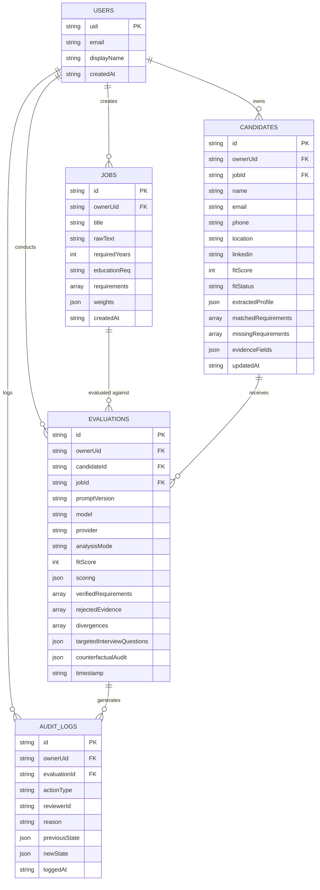

# HireLens — Database Schema Specification

HireLens uses a multi-tenant, user-isolated document storage model. In production environments, data is stored in **Google Cloud Firestore** (or in a locally synchronized repository file with mutex atomic concurrency in development: `server/data/store.json`).

All collections enforce per-user document isolation via the `ownerUid` attribute.

---

## 1. Entity Relationship Diagram

---

## 2. Firestore Collection Specifications

### 2.1. `jobs` Collection
Stores normalized job descriptions with structured competency criteria and scoring weights.

| Field | Type | Required | Description |
| :--- | :--- | :---: | :--- |
| `id` | `string` | Yes | Unique Job identifier (`job_...`). |
| `ownerUid` | `string` | Yes | Firebase user UID of the recruiter owning this job. |
| `title` | `string` | Yes | Job position title. |
| `rawText` | `string` | Yes | Full verbatim job description text. |
| `requiredYears` | `number` | Yes | Minimum professional experience required. |
| `educationReq` | `string` | No | Minimum degree credential required. |
| `requirements` | `array<object>` | Yes | List of structured requirements: `{ id, title, skill, isMandatory, weight }`. |
| `weights` | `map` | Yes | Deterministic scorer weights: `{ skills, experience, impact, education }`. |
| `createdAt` | `timestamp` | Yes | ISO-8601 creation timestamp. |

### 2.2. `candidates` Collection
Stores candidate identity facts extracted from uploaded resumes.

| Field | Type | Required | Description |
| :--- | :--- | :---: | :--- |
| `id` | `string` | Yes | Unique Candidate identifier (`c_...`). |
| `ownerUid` | `string` | Yes | Recruiter owner UID for multi-tenant isolation. |
| `jobId` | `string` | Yes | ID of the job position applied to. |
| `evaluationId` | `string` | Yes | ID of the latest evaluation record. |
| `name` | `string \| null` | No | Full candidate name (`NOT_FOUND` if absent). |
| `email` | `string \| null` | No | Extracted email address (`NOT_FOUND` if absent). |
| `phone` | `string \| null` | No | Extracted phone number. |
| `location` | `string \| null` | No | Candidate geographic location. |
| `fitScore` | `number` | Yes | Grounded fit score (0–100). |
| `fitStatus` | `string` | Yes | Fit classification: `Strong Match` \| `Moderate Match` \| `Partial Match`. |
| `extractedProfile`| `map` | Yes | Extracted education, experience items, and taxonomy skills. |
| `evidenceFields` | `map` | Yes | Verbatim text spans with character offsets and confidence scores. |
| `updatedAt` | `timestamp` | Yes | Last evaluation update timestamp. |

### 2.3. `evaluations` Collection
Stores the complete audit trail and grounded score calculation for a `(candidateId, jobId)` evaluation run.

| Field | Type | Required | Description |
| :--- | :--- | :---: | :--- |
| `id` | `string` | Yes | Evaluation identifier (`eval_...`). |
| `ownerUid` | `string` | Yes | Recruiter owner UID. |
| `candidateId` | `string` | Yes | Candidate reference. |
| `jobId` | `string` | Yes | Job reference. |
| `promptVersion` | `string` | Yes | Version tag of the prompt used (`v1.0.0`). |
| `model` | `string` | Yes | Model identifier (e.g., `gemini-1.5-flash`). |
| `provider` | `string` | Yes | AI provider: `gemini` \| `openai` \| `groq` \| `heuristic`. |
| `analysisMode` | `string` | Yes | `ai` or `heuristic`. |
| `fitScore` | `number` | Yes | Final deterministic composite score. |
| `scoring` | `map` | Yes | Full breakdown: sub-scores, weights, and point attributions. |
| `verifiedRequirements` | `array<object>` | Yes | Grounded requirement records with status and character offsets. |
| `rejectedEvidence` | `array<object>` | Yes | Hallucinated quotes rejected by grounding engine. |
| `divergences` | `array<object>` | Yes | List of LLM claims vs grounded verification discrepancies. |
| `counterfactualAudit`| `map` | No | Counterfactual bias testing results and demographic delta metrics. |
| `timestamp` | `timestamp` | Yes | Evaluation timestamp. |

### 2.4. `auditLogs` Collection (Append-Only Immutable Ledger)
Records recruiter manual overrides, blind mode reveal events, and critical audit occurrences.

| Field | Type | Required | Description |
| :--- | :--- | :---: | :--- |
| `id` | `string` | Yes | Log identifier (`log_...`). |
| `ownerUid` | `string` | Yes | Recruiter owner UID. |
| `evaluationId` | `string` | Yes | Associated evaluation reference. |
| `actionType` | `string` | Yes | `OVERRIDE_DECISION` \| `IDENTITY_REVEAL` \| `BIAS_AUDIT_RUN`. |
| `reviewerId` | `string` | Yes | Email or UID of the reviewer performing the action. |
| `reason` | `string` | Yes | Mandatory human rationale recorded for accountability. |
| `previousState` | `map` | No | State before override. |
| `newState` | `map` | No | State after override. |
| `loggedAt` | `timestamp` | Yes | Immutable timestamp. |

---

## 3. Security Rules & Indexes

### 3.1. Firestore Security Rules
Implemented in [`firestore.rules`](../firestore.rules):
- **Authentication Check**: All requests must supply a valid Firebase Auth context (`request.auth != null`).
- **Owner Isolation**: Users can only query and write documents matching `resource.data.ownerUid == request.auth.uid`.
- **Immutability of Audit Logs**: `auditLogs` documents can only be created and read; `update` and `delete` operations are strictly blocked by security rules (`allow update, delete: if false;`).

### 3.2. Compound Indexes
Defined in [`firestore.indexes.json`](../firestore.indexes.json):
1. `evaluations`: `(ownerUid ASC, jobId ASC, fitScore DESC)` — Enables instant leaderboard ranking within a job.
2. `evaluations`: `(ownerUid ASC, candidateId ASC, createdAt DESC)` — Enables historical candidate re-evaluations.
3. `candidates`: `(ownerUid ASC, createdAt DESC)` — Fast candidate listing on dashboard.
4. `auditLogs`: `(ownerUid ASC, timestamp DESC)` — Ordered compliance audit trail display.
